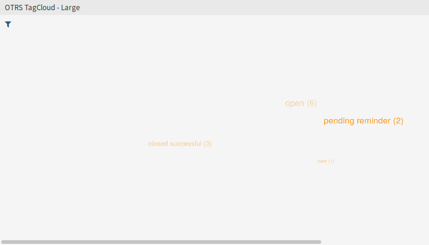
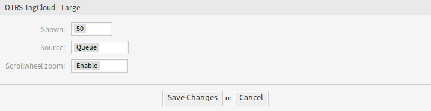
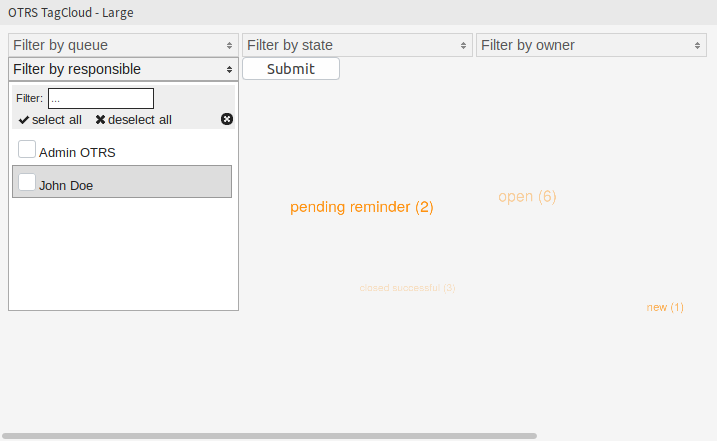

Dashboard
=========

This package adds a small tag cloud widget to the right sidebar of the dashboard and a large tag cloud widget to the content widgets of the agent dashboard. Each logged in agent has the option to configure or hide the tag cloud widgets according to personal preferences.

   Large Tag Cloud Widget

The tag cloud widget displays a selection of top entries of the configured source. When clicking on one of the displayed tags, a ticket request with the selected value is started as a search criterion in a new browser window.

To turn on or off the tag cloud widgets:

1. Click on the *Settings* widget in the right sidebar to expand it.
2. Select or deselect the widgets *OTRS TagCloud – Small* and *OTRS TagCloud – Large*.
3. Click on the *Save settings* button.

.. seealso::

   You can also remove a widget, if you hover the mouse over the widget header and click on the *×* on the top right corner to close the widget.

To configure a tag cloud widget:

1. Hover the mouse over the widget header.
2. Click on the gear icon in the top right corner.
3. Modify the fields.
4. Click on the *Save Changes* button.

   Tag Cloud Settings

Each agent can configure individual tag clouds independently from other agents or tag clouds in the dashboard. The settings are stored separately for each tag cloud and agent.

Shown
   Select, how many tags should be displayed in the widget. The most common tags are always displayed.

Source
   Select, from which source should be the tags visualizing. It is possible to selected between the ticket fields like priority, queue, SLA, service, status and type, as well as for ticket search configured dynamic fields.

   .. seealso::

      To configure the dynamic fields for the ticket search screen, see the setting ``Ticket::Frontend::AgentTicketTicketSearch###DynamicField``.

Scrollwheel zoom
   If enabled, the scroll wheel of the mouse can be used to zoom in or out in the tag cloud instead of scrolling the page. The zoom can be helpful if you want to enter deeper into the tag cloud.

It is possible that empty values are stored in dynamic fields. These are represented by the string *Empty*. If no data is available for the selected source, an error message with corresponding text is displayed. This tells the agent the missing data and asks him to choose another source for the tags.

The tag cloud offers the possibility to filter the tag search for queues, states, owners and responsible person. For this, the configuration parameter ``FilterEnabled`` must be activated in the setting of the tag cloud in the system configuration.

To filter the sources:

1. Click on the filter icon in the top left corner of the content area in the tag cloud widget.
2. Add some filter criteria with the filter options.
3. Click on the *Submit* button.

   Tag Cloud Filters

An asynchronous request is sent to the server that delivers the new tag data without reloading the entire page. While this request is running, an icon appears in the upper right corner of the widget.

The used filters are retained beyond the existing session and do not expire when logging off.
