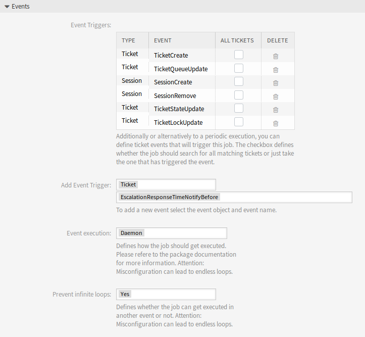
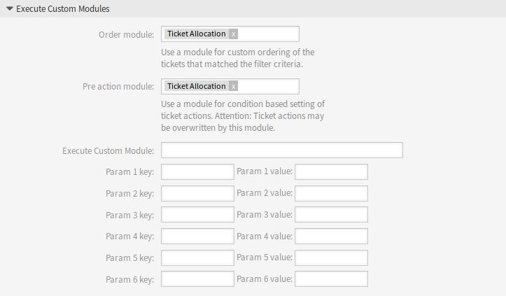

Generic Agent
=============

The ticket allocation functionality is based on the event based ticket actions feature from the generic agent. The job can be executed for all matching tickets or just the ticket that has triggered the event. Additionally it is possible to define custom order modules and pre action modules for the generic agent job. This package provides one order and pre action module to allocate tickets. It uses the triggers to execute the allocation process.

After installation of the package a generic agent job called *TicketAllocation* is added to the system. This job is a basic ticket allocation configuration that can be customized and extended.

The filtering of tickets has not changed from the default generic agent behavior. For the most cases the default event configuration of the ticket allocation job did not have to be changed. The events should be self-explanatory. They represent the different ticket actions and the login/logoff of agents.

By default the job is executed via the OTRS daemon to avoid blocking the agent and preventing infinite allocation loops. Additionally it is necessary to set the prevent infinite loops to *Yes*.

By default the *TicketAllocation* pre action module will set the ticket lock. This will trigger another ``TicketLockUpdate`` event, which will start a new job and so on. The ``TicketLockUpdate`` event is required to make it possible to react on automatic and manual ticket unlocks to reallocate tickets. It is recommended to keep these settings.

   Events Section

In the *Execute Custom Modules* widget are two select fields which define if an *Order Module* and/or *Pre Action Module* should get executed. This package adds one order module and pre action module to the system.

   Execute Custom Modules Section

The order module is not mandatory to use for the allocation functionality. There are a couple of system configuration settings that can influence the order of the tickets. If the order should get manipulated it is necessary to use the *TicketAllocation* order module. The pre action module is necessary to manipulate the ticket attributes that the tickets should get set. There are some system configuration settings to influence the allocation process, too.

It is possible to set additional attributes the processed tickets should get set. The *TicketAllocation* pre action module will set the owner and the lock (if configured) for the tickets, if there are no errors in the allocation process and a matching agent can be found. If no allocation can be made, it is possible to set default values in the *Update/Add Ticket Attributes* widget of the generic agent for the owner and lock. If an allocation is made these values will be overwritten.
