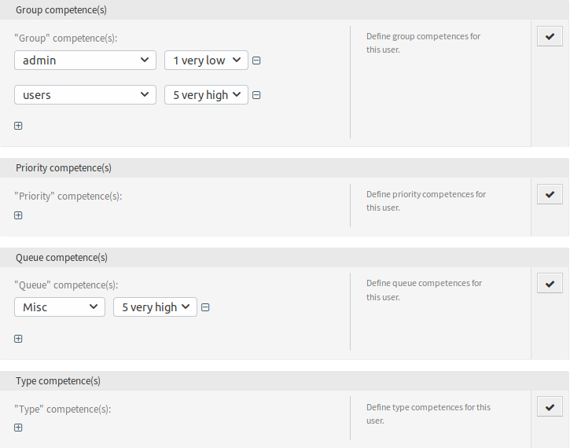

Agents
======

With this package it is possible to define different competences for agents.

The competences can be enabled and disabled via the system configuration. By default the ticket competences group, priority, queue and type are enabled. Role, SLA and service are disabled but can be enabled via the system configuration.

To set the competences for an agent:

1. Open the *Agents Management* screen in the administrator interface.
2. Select an agent from the list.
3. Click on the *Edit personal preferences for this agent* button in the left sidebar.
4. Click on the *Competences* module in the agent personal preferences.

   Competences Screen

The competences have no direct influence on the behavior of the system. They can be used in other functionalities to make decisions based on the configured values and influence the behavior.

By default the relevant tickets will be allocated ordered by their internal ticket ID and their creation time. This package provides an order module for changing the order of the relevant tickets, based on different system configuration settings. The ticket order can be influenced by configurable queue priorities and service times.

Additionally it is possible to set a maximum number of tickets per queue in a row that should get allocated. If the limit is reached, the next different queue will be preferred. After that,
the counter for the queue is reset.

.. seealso::

   Take a look at the configuration options in the system configuration for this package.
