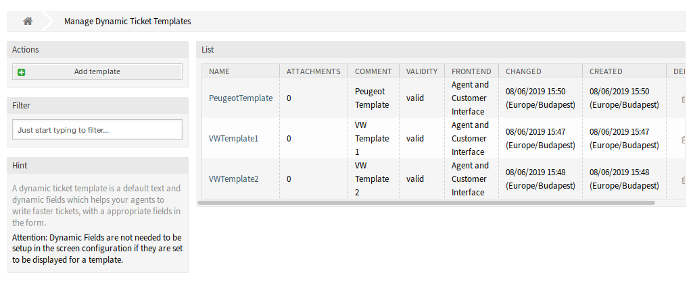
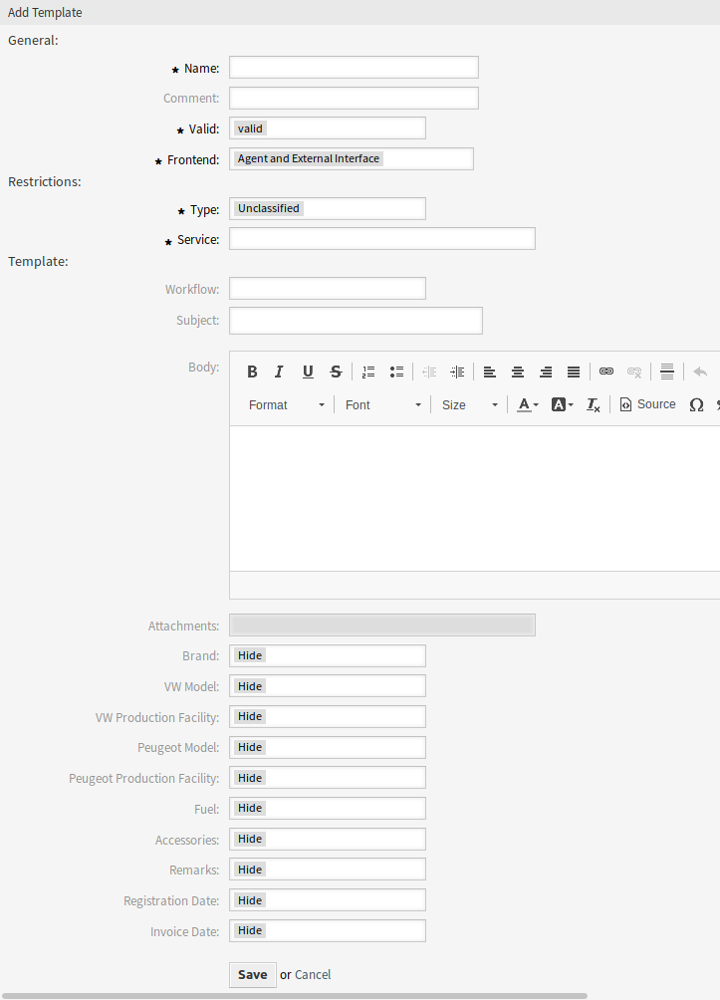
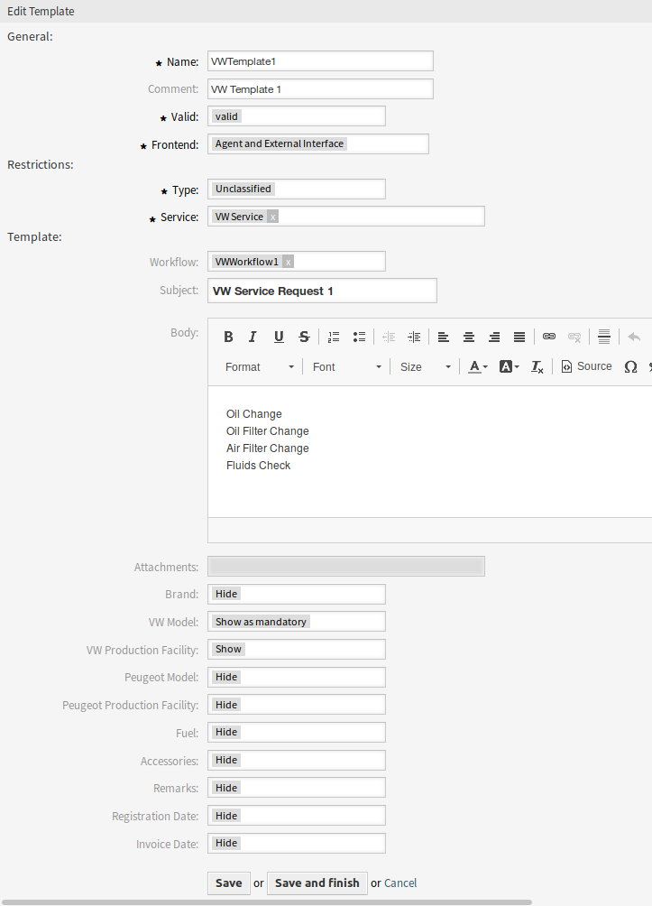
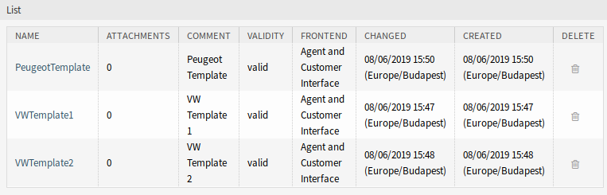
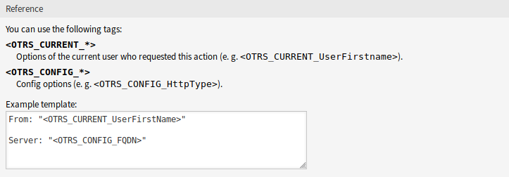

Dynamic Ticket Templates
========================

Use this screen to add dynamic ticket templates for use in communications. The dynamic ticket template management screen is available in the *Dynamic Ticket Templates* module of the *Ticket Settings* group.

   Dynamic Ticket Templates Management Screen

Manage Dynamic Ticket Templates
-------------------------------

.. note::

   To add attachments to a dynamic ticket template, it needs to create the attachment first in the *Attachment Management* screen.

To add a dynamic ticket template:

1. Click on the *Add Template* button in the left sidebar.
2. Fill in the required fields.
3. Click on the *Save* button.

   Add Dynamic Ticket Template Screen

To edit a dynamic ticket template:

1. Click on a dynamic ticket template in the list of dynamic ticket templates.
2. Modify the fields.
3. Click on the *Save* or *Save and finish* button.

   Edit Dynamic Ticket Template Screen

To delete a dynamic ticket template:

1. Click on the trash icon in the list of dynamic ticket templates.
2. Click on the *Confirm* button.

   Delete Dynamic Ticket Template Screen

.. note::

   If several dynamic ticket templates are added to the system, use the filter box to find a particular dynamic ticket template by just typing to filter.

Dynamic Ticket Template Settings
--------------------------------

The following settings are available when adding or editing this resource. The fields marked with an asterisk are mandatory.

Name \*
   The name of this resource. Any type of characters can be entered to this field including uppercase letters and spaces. The name will be displayed in the overview table.

Comment
   Add additional information to this resource. It is recommended to always fill this field as a description of the resource with a full sentence for better clarity, because the comment will be also displayed in the overview table.

Valid \*
   Set the validity of this resource. Each resource can be used in OTRS only, if this field is set to *valid*. Setting this field to *invalid* or *invalid-temporarily* will disable the use of the resource.

Frontend \*
   Defines, where can the dynamic ticket template be used. A dynamic ticket template can be used in the following interfaces:

      - Agent Interface
      - Agent and External Interface
      - External Interface

Type \*
   Select a ticket type, that has been added to the system.

Service \*
   Select a service, that has been added to the system.

Workflow
   Select a ticket workflow, that has been added to the system.

   .. note::

      This field is displayed only, if the :doc:`../../../ticket-workflow` package is installed.

Subject
   The subject of the email sent to the users.

Body
   The body of the email sent to the users.

Attachments
   It is possible to add one or more attachments to this template. Attachments can be added in the *Attachment Management* screen.

Dynamic Fields
   The list of dynamic fields are displayed in this section. Choose for each dynamic field to *Hide*, *Show* or *Show as mandatory* on ticket create screens.

Dynamic Ticket Template Variables
---------------------------------

Using variables in the text makes it possible to personalize messages. Variables, known as OTRS tags, are replaced by the system when generating the message. Find a list of available tags stems for this resource at the bottom of both add and edit screens.

   Dynamic Ticket Template Variables

For example, the variable ``<OTRS_TICKET_TicketNumber>`` expands to the ticket number allowing a template to include something like the following.

.. code-block:: text

   Ticket#<OTRS_TICKET_TicketNumber>

This tag expands, for example to:

.. code-block:: text

   Ticket#2018101042000012
