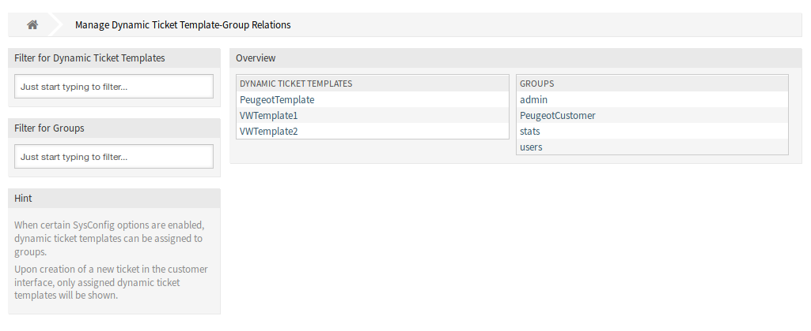
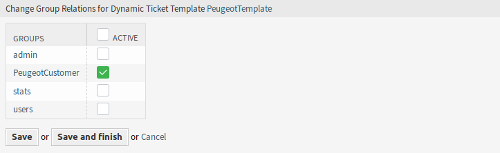
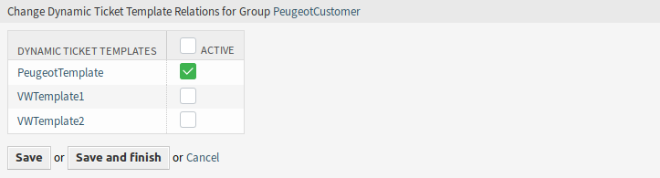

Dynamic Ticket Templates ↔ Groups
=================================

Use this screen to add one or more dynamic ticket templates to one or more groups. To use this function, at least one dynamic ticket template and one group need to have been added to the system. The management screen is available in the *Dynamic Ticket Templates ↔ Groups* module of the *Users, Groups & Roles* group.

   Manage Dynamic Ticket Template-Group Relations

Manage Dynamic Ticket Templates ↔ Groups Relations
--------------------------------------------------

To assign some groups to a dynamic ticket template:

1. Click on a dynamic ticket template in the *Dynamic Ticket Templates* column.
2. Select the groups you would like to assign the dynamic ticket template to.
3. Click on the *Save* or *Save and finish* button.

   Change Group Relations for Dynamic Ticket Template

To assign some dynamic ticket templates to a group:

1. Click on a group in the *Groups* column.
2. Select the dynamic ticket templates you would like to assign the group to.
3. Click on the *Save* or *Save and finish* button.

   Change Dynamic Ticket Template Relations for Group

.. note::

   If several dynamic ticket templates or groups are added to the system, use the filter box to find a particular dynamic ticket template or group by just typing the name to filter.

Multiple dynamic ticket templates or groups can be assigned in both screens at the same time. Additionally clicking on a dynamic ticket template or clicking on a group in the relations screen will open the *Edit Template* screen or the *Edit Group* screen accordingly.

.. warning::

   Accessing a dynamic ticket template or a group provides no back link to the relations screen.
