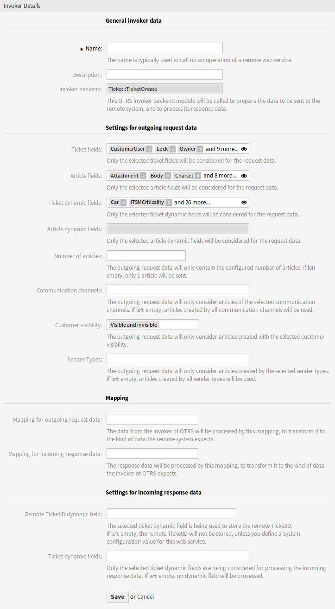

Web Services
============

After installation of the package, two new invokers will be available in the *Invokers* section. Selecting an invoker from the drop-down list will open a new settings window.

Request Example
---------------

``TicketCreate`` and ``TicketUpdate`` invoker returns the complete ticket and article data based on ticket ID and article ID of the triggered event.

Prepare the invocation of the configured remote web service. Event data:

.. code-block:: perl

   my $Result = $InvokerObject->PrepareRequest(
       Data => {                                               # data payload
           TicketID => 123,
           ArticleID => 123,                                   # optional
       },
   );

Invoker result:

.. code-block:: perl

   {
       Data => {
           Ticket => {
               Title         => 'some ticket title',
               Queue         => 'some queue name',
               Lock          => 'some lock name',              # optional
               Type          => 'some type name',              # optional
               Service       => 'some service name',           # optional
               SLA           => 'some SLA name',               # optional
               State         => 'some state name',
               Priority      => 'some priority name',
               Owner         => 'some user login',             # optional
               Responsible   => 'some user login',             # optional
               CustomerUser  => 'some customer user login',
               PendingTime {       # optional
                   Year   => 2011,
                   Month  => 12
                   Day    => 03,
                   Hour   => 23,
                   Minute => 05,
               },
           },
           Article => {
               SenderType       => 'some sender type name',    # optional
               AutoResponseType => 'some auto response type',  # optional
               From             => 'some from string',         # optional
               Subject          => 'some subject',
               Body             => 'some body'
               ContentType      => 'some content type',        # ContentType or MimeType and Charset is required
               MimeType         => 'some mime type',
               Charset          => 'some charset',
               TimeUnit         => 123,                        # optional
           },
           DynamicField => [                                   # optional
               {
                   Name   => 'some name',
                   Value  => 'Value',                          # value type depends on the dynamic field
               },
               # ...
           ],
            Attachment => [
               {
                   Content     => 'content'                    # base64 encoded
                   ContentType => 'some content type'
                   Filename    => 'some fine name'
               },
               # ...
           ],
       },
   };

.. note::

   The invoker will return the newest article of the ticket if no article ID is given.

.. note::

   The invoker will not return dynamic fields with undefined values, because the same named operations ``TicketCreate`` and ``TicketUpdate`` does not handle dynamic fields with undefined values.

Advanced Filtering for Outgoing Data
------------------------------------

For outgoing data, it is possible to define what kind of ticket fields, article fields or dynamic fields the request should contain. Furthermore it is possible to filter by article type and article sender type.

The different filter options can be selected within every single invoker configuration and are listed in section *Settings for outgoing request data*.

   Invoker Details Screen

The following settings are available when adding or editing this resource. The fields marked with an asterisk are mandatory.

General Invoker Data
~~~~~~~~~~~~~~~~~~~~

Name \*
   The name of this resource. Any type of characters can be entered to this field including uppercase letters and spaces. The name will be displayed in the overview table.

Description
   Add additional information to this resource. It is recommended to always fill this field as a description of the resource with a full sentence for better clarity, because the comment will be also displayed in the overview table.

Invoker backend
   This invoker back end module will be called to prepare the data to be sent to the remote system, and to process its response data. The field is read-only, it was selected in the previous screen.

Settings for Outgoing Request Data
~~~~~~~~~~~~~~~~~~~~~~~~~~~~~~~~~~

Ticket fields
   A multi-select menu containing the available ticket attributes (fields), that can be submitted to a remote system. Just the fields that are selected will be included in outgoing requests.

Article fields
   A multi-select menu containing the available article attributes (fields), that can be submitted to a remote system. Just the fields that are selected will be included in outgoing requests.

Ticket dynamic fields
   A multi-select menu containing the available ticket dynamic fields, that can be submitted to a remote system. Just the dynamic fields that are selected will be included in outgoing requests.

Article dynamic fields
   A multi-select menu containing the available article dynamic fields, that can be submitted to a remote system. Just the dynamic fields that are selected will be included in outgoing requests.

Number of articles
   A text field containing the maximum number of articles, that will be transmitted during an outgoing request. The articles will be selected from newest (latest) to oldest. If no number is given, just the latest article will be transmitted.

Communication channels
   The outgoing request data will only consider articles of the selected communication channels. If left empty, articles created by all communication channels will be used.

Customer visibility
   The outgoing request data will only consider articles created with the selected customer visibility.

Sender Types
   The outgoing request data will only consider articles created by the selected sender types. If left empty, articles created by all sender types will be used.

Mapping
~~~~~~~

Mapping for outgoing request data
   The data from the invoker will be processed by this mapping, to transform it to the kind of data the remote system expects.

Mapping for incoming response data
   The response data will be processed by this mapping, to transform it to the kind of data the invoker expects.

Settings for Incoming Response Data
~~~~~~~~~~~~~~~~~~~~~~~~~~~~~~~~~~~

It is possible to automatically save certain data of incoming responses to local dynamic fields. The different filter options can be selected within every single invoker configuration.

Remote Ticket ID dynamic field
   A drop-down menu containing the available ticket dynamic fields in the system. If such a dynamic field is selected, the received ticket ID from the remote system will be used, to be saved within the selected dynamic field.

Ticket dynamic fields
   A multi-select menu containing the available ticket dynamic fields in the system. All selected dynamic fields, that also available in the response data and containing values, will be saved to the local dynamic fields.

The dynamic field values of the response data will be used from the following data structure:

.. code-block:: xml

   <Ticket>
       <DynamicField>..</DynamicField>
   </Ticket>

and/or

.. code-block:: xml

   <Ticket>
       <Article>
           <DynamicField>..</DynamicField>
       </Article>
   </Ticket>

The system configuration option ``GenericInterface::Invoker::Settings::ResponseDynamicField`` was added as a fallback for the dynamic fields that should contain the result ticket ID of the related response data. It shall be used, if the configuration was not added via the invoker GUI and both configurations should not be used at the same time!

Event Triggers
~~~~~~~~~~~~~~

Event
   This invoker will be triggered by the configured events.

Add Event Trigger
   To add a new event select the event object and event name and click on the *+* button. Asynchronous event triggers are handled by the OTRS daemon in background (recommended). Synchronous event triggers would be processed directly during the web request.

Set Additional Outbound Headers
-------------------------------

.. note::

   This functionality is only available in combination with **STORM powered by OTRS™**.

This functionality allows to set arbitrary HTTP headers for outbound communication of HTTP::REST and HTTP::SOAP based web services (*Requester* requests and *Provider* responses), superseding the *additional response headers* functionality.

Within the *Transport* configuration it is now possible to define common headers (which are set for every outbound communication of the web service *Requester*/*Provider*) and *Invoker*/*Operation* specific headers (which are only set if the respective *Invoker*/*Operation* is used).

Headers are only allowed to be used once within a configuration type and those from specific configuration override common configuration headers.

Some headers are blocked for safety purposes. If needed, the list of blocked headers can be changed in system configuration using the settings ``GenericInterface::Invoker::OutboundHeaderBlacklist`` and ``GenericInterface::Operation::OutboundHeaderBlacklist`` respectively.

.. note::

   Headers defined using the previous *additional response headers* functionality will continue to work and will be upgraded to the new functionality when the *Provider* transport configuration is changed the next time.
