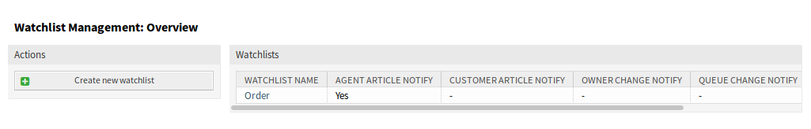
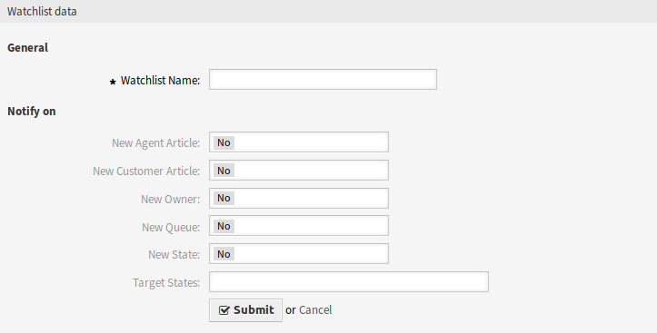
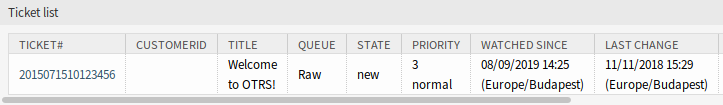
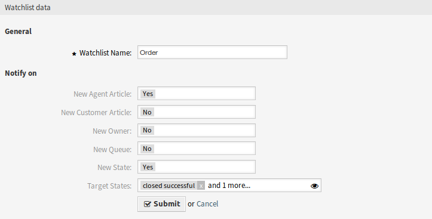
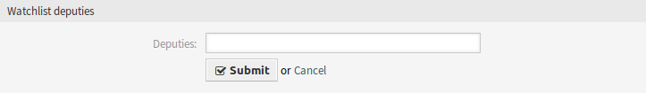
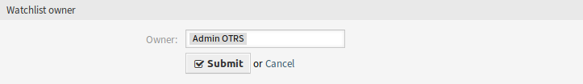
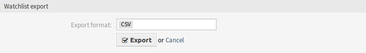
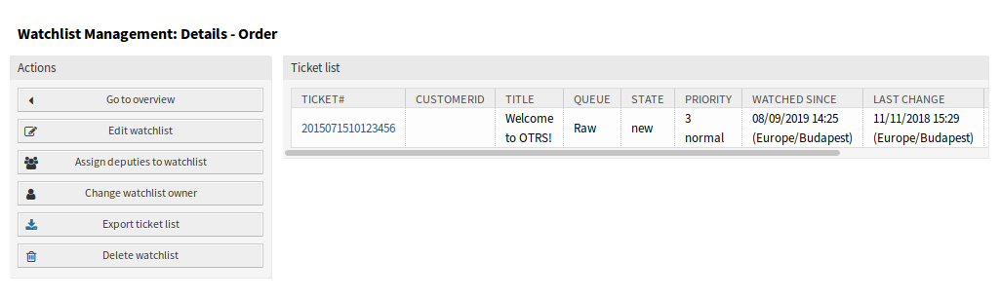

Watchlist Management
====================

Use this screen to manage watch lists. The watch list management screen is available in the *Watchlist Management* menu item of the *Tickets* menu or via the eye icon from the toolbar.

   Watchlist Management Screen

Manage Watch Lists
------------------

To add a watch list:

1. Click on the *Create new watchlist* button in the left sidebar.
2. Fill in the required field.
3. Click on the *Submit* button.

   Add Watchlist Screen

To see the tickets in a watch list:

1. Click on a watch list in the list of watch lists.
2. See the tickets in the overview table.

   Watchlist Details Screen

To edit a watch list:

1. Click on a watch list in the list of watch lists.
2. Click on the *Edit watchlist* button in the left sidebar.
3. Modify the field.
4. Click on the *Submit* button.

   Edit Watchlist Screen

To assign deputies to a watch list:

1. Click on a watch list in the list of watch lists.
2. Click on the *Assign deputies to watchlist* button in the left sidebar.
3. Select deputy agents from the list.
4. Click on the *Submit* button.

   Watchlist Deputies Screen

To change the watch list owner:

1. Click on a watch list in the list of watch lists.
2. Click on the *Change watchlist owner* button in the left sidebar.
3. Select an agent from the list.
4. Click on the *Submit* button.

   Watchlist Owner Screen

.. warning::

   The original owner agent will not have access to the watch list anymore.

To export the ticket list from a watch list:

1. Click on a watch list in the list of watch lists.
2. Click on the *Export ticket list* button in the left sidebar.
3. Select the output format.
4. Click on the *Export* button.
5. Save the file somewhere in the file system.

   Watchlist Export Screen

To delete a watch list:

1. Click on a watch list in the list of watch lists.
2. Click on the *Delete watchlist* button in the left sidebar.
3. Click on the *OK* button in the confirmation dialog.

   Delete Watchlist Screen

Tickets can be added to the watch list or removed from the watch list in the :doc:`ticket-zoom` screen.

Watch List Settings
-------------------

The following settings are available when adding or editing this resource. The fields marked with an asterisk are mandatory.

Watchlist Name \*
   The name of this resource. Any type of characters can be entered to this field including uppercase letters and spaces. The name will be displayed in the overview table.

New Agent Article
   Set to *Yes*, if the watch list owner should be notified, when an agent adds a note to a ticket added to the watch list.

New Customer Article
   Set to *Yes*, if the watch list owner should be notified, when a customer user creates an article in the external interface.

New Owner
   Set to *Yes*, if the watch list owner should be notified, when a ticket added to the watch list has a new owner.

New Queue
   Set to *Yes*, if the watch list owner should be notified, when a ticket added to the watch list has been moved to an other queue.

New State
   Set to *Yes*, if the watch list owner should be notified, when a state is changed for a ticket added to the watch list.

Target States
   The states selected here will activate the *New State* notification above. Notifications for status changes are only being sent if the new status matches the configured destination status.

   If the *New State* notification is set to *Yes*, this field becomes mandatory.

Watch list owners and their deputies can configure the notifications separately. The configuration of the destination status is only allowed for the watch list owner and therefore also affects the deputies.

Notifications are not being sent to the agent who triggered the action.

.. seealso::

   The content of the notifications can be edited in the :doc:`../../admin/communication-notifications/ticket-notifications` module of the administrator interface.
