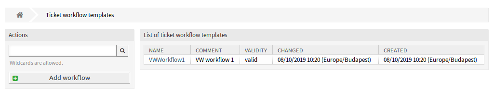
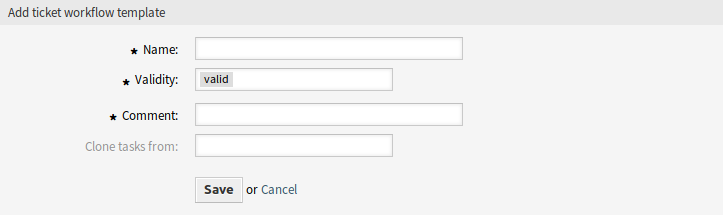
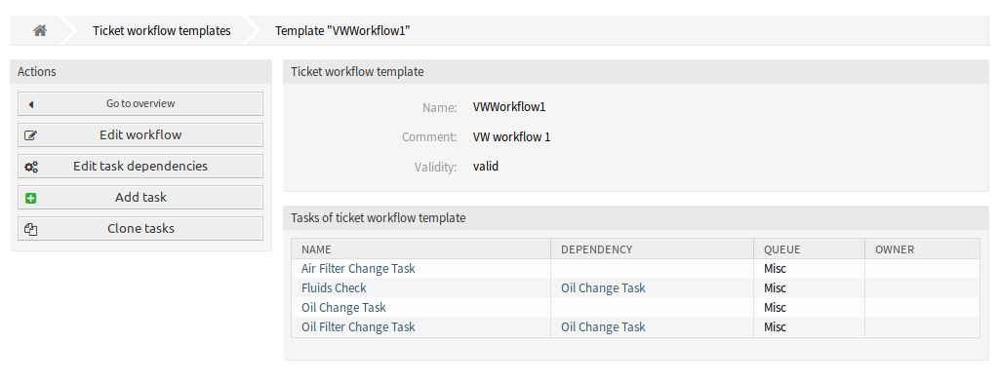
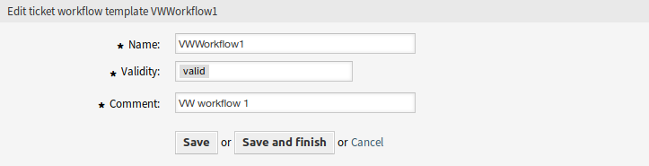
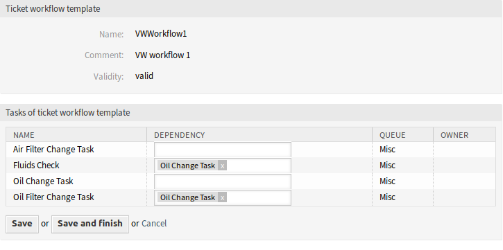
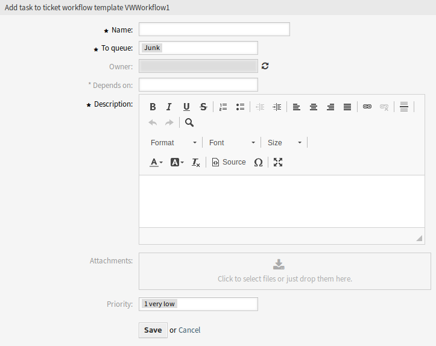
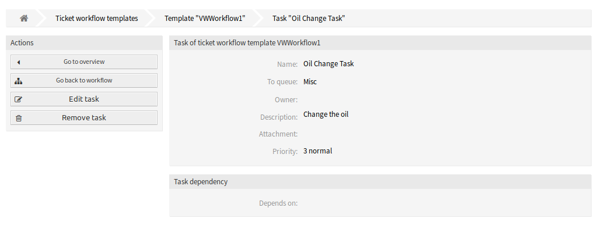
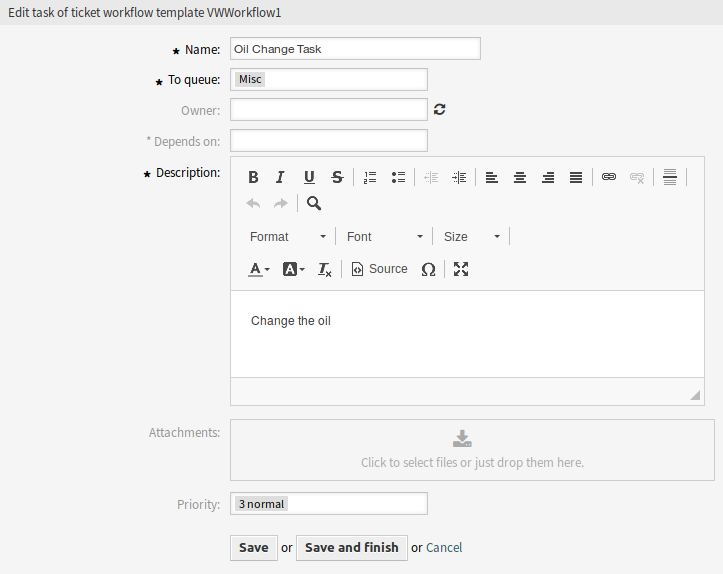
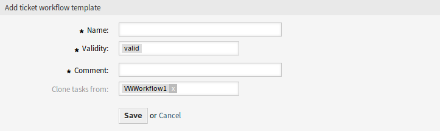

Ticket Workflows
================

Use this screen to add workflows and tasks to the system. The ticket workflow templates management screen is available in the *Ticket Workflows* module of the *Ticket Settings* group.

   Ticket Workflow Templates Screen

Manage Ticket Workflow Templates
--------------------------------

To add a ticket workflow template:

1. Click on the *Add workflow* button in the left sidebar.
2. Fill in the required fields.
3. Click on the *Save* button.

   Add Ticket Workflow Template Screen

.. warning::

   Ticket workflow templates can not be deleted from the system. They can only be deactivated by setting the *Validity* option to *invalid* or *invalid-temporarily*.

To view the details of a ticket workflow template and go to the management screen:

1. Click on a ticket workflow template in the list of ticket workflow templates.

   Ticket Workflow Details Screen

To edit a ticket workflow template:

1. Click on a ticket workflow template in the list of ticket workflow templates.
2. Click on the *Edit workflow* button in the left sidebar.
3. Modify the fields.
4. Click on the *Save* or *Save and finish* button.

   Edit Ticket Workflow Template Screen

To edit the task dependencies:

1. Click on a ticket workflow template in the list of ticket workflow templates.
2. Click on the *Edit task dependencies* button in the left sidebar.
3. Add or remove task in the *Dependencies* column.
4. Click on the *Save* or *Save and finish* button.

   Edit Ticket Workflow Task Dependencies Screen

To add a task to a ticket workflow template:

1. Click on a ticket workflow template in the list of ticket workflow templates.
2. Click on the *Add task* button in the left sidebar.
3. Fill in the required fields.
4. Click on the *Save* button.

   Add Ticket Workflow Task Screen

To view the details of a task in a ticket workflow template:

1. Click on a ticket workflow template in the list of ticket workflow templates.
2. Click on a task in the list of tasks.

   Ticket Workflow Task Details Screen

To edit a task in a ticket workflow template:

1. Click on a ticket workflow template in the list of ticket workflow templates.
2. Click on a task in the list of tasks.
3. Click on the *Edit task* button in the left sidebar.
4. Modify the fields.
5. Click on the *Save* or *Save and finish* button.

   Edit Ticket Workflow Task Screen

To delete a task from a ticket workflow template:

1. Click on a ticket workflow template in the list of ticket workflow templates.
2. Click on a task in the list of tasks.
3. Click on the *Remove task* button in the left sidebar.
4. Click on the *OK* button in the confirmation dialog.

To clone a ticket workflow template:

1. Click on a ticket workflow template in the list of ticket workflow templates.
2. Click on the *Clone tasks* button in the left sidebar.
3. Fill in the required fields.
4. Click on the *Save* button.

   Clone Ticket Workflow Template Screen

.. note::

   If several templates are added to the system, a filter box is useful to find a particular template by just typing to filter.

Ticket Workflow Template Settings
---------------------------------

The following settings are available when adding or editing this resource. The fields marked with an asterisk are mandatory.

Name \*
   The name of this resource. Any type of characters can be entered to this field including uppercase letters and spaces. The name will be displayed in the overview table.

Validity \*
   Set the validity of this resource. Each resource can be used in OTRS only, if this field is set to *valid*. Setting this field to *invalid* or *invalid-temporarily* will disable the use of the resource.

Comment \*
   Add additional information to this resource. It is recommended to always fill this field as a description of the resource with a full sentence for better clarity, because the comment will be also displayed in the overview table.

Clone tasks from
   Select an other workflow to clone its tasks from. This field is only available when using the *Clone tasks* button.

Workflow templates can inherit attributes and dynamic fields from the master ticket. Each ticket attribute or dynamic field to be copied from master ticket to task has to be defined in system configuration.

Ticket Workflow Task Settings
-----------------------------

The following settings are available when adding or editing this resource. The fields marked with an asterisk are mandatory.

Name \*
   The name of this resource. Any type of characters can be entered to this field including uppercase letters and spaces. The name will be displayed in the overview table.

To queue \*
   The queue, where the new ticket will be placed to.

Owner
   The owner is an agent, who actually works with the new ticket.

Depends on
   Select an other task from which the current task depends on. The dependency task must be finished before starting the current task.

Description
   Longer text description of the ticket.

   .. note::

      It is not possible to use images within the description of a task. If there is a need for images within tasks, they can be uploaded separately as attachments.

Attachments
   It is possible to add attachments to the ticket. Click on the field to add an attachment, or just drop some files here.

Priority
   New tickets have *3 normal* priority by default. Select an other priority if you want to change it.
