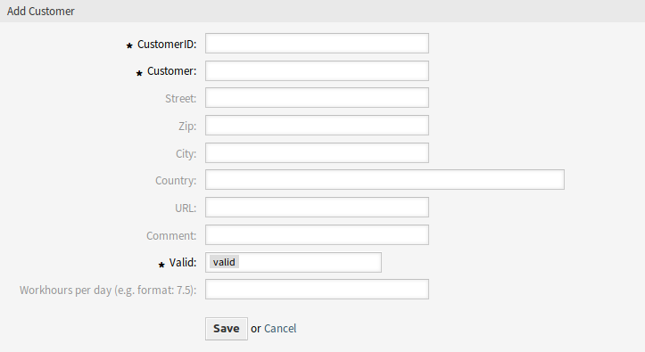

Customers
=========

After installation of the package a new field is added to the *Add Customer* and *Edit Customer* screens.

   Add Customer Screen

New Field
---------

Workhours per day
   Add the working hours per day if it is different from the normal working day. If the field is left empty, 8 hours par day is calculated.
