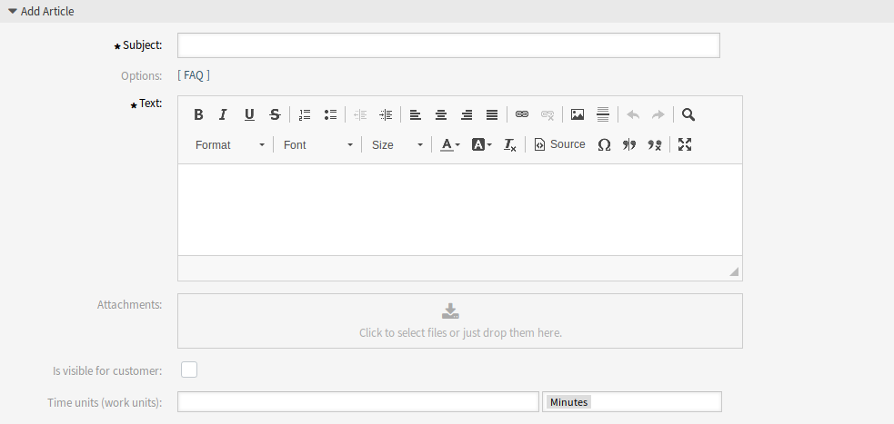

Ticket Zoom
===========

For each ticket you can set a time to reduce the quota of the customer. It is based on the work time units and there is a new drop-down field to reduce the contingent in hours or minutes.

To reduce quota in a ticket:

1. Create a ticket based for the customer.
2. Open the ticket in the *Ticket Zoom* screen. A new *Quota list* widget is also displayed in the right sidebar.
3. Add a note or any other communication article that has quota field.
4. Add a new time unit based on hours or minutes to reduce the quota.

   Add Article Screen

.. note::

   The quota can be also reduced in any ticket create screens.
