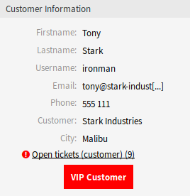

Agent Interface
===============

If a customer user is configured as a VIP, the *Customer Information* widget will show the VIP status of the user with a big red *VIP Customer* badge.

   Customer Information Widget

The extended *Customer Information* widget is available in all ticket create screens as well as in the *Ticket Zoom* screen.

If an SLA is configured to be only shown for VIP customer users, it will not be available anymore to regular users.
